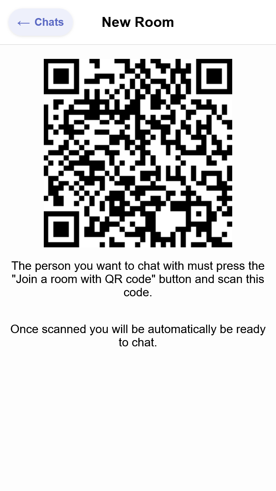
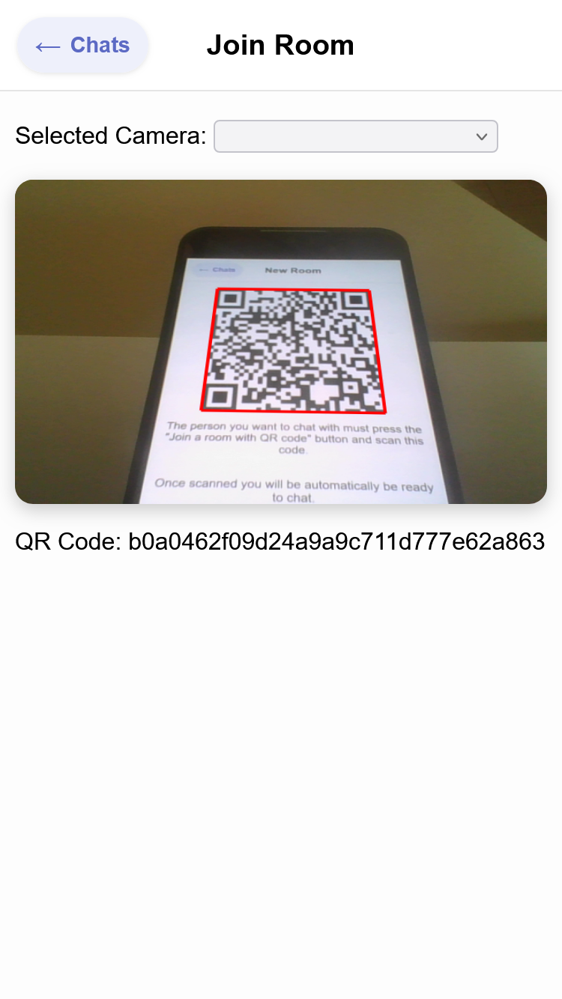
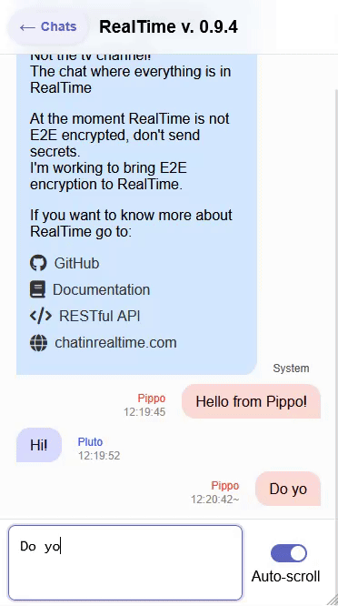
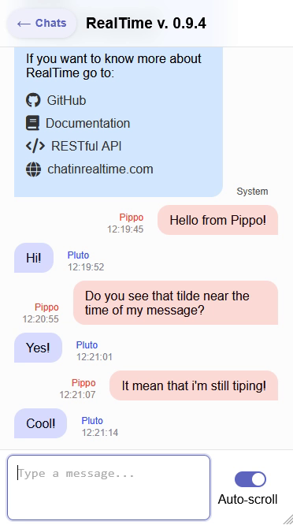

# RealTime
*Not the TV channel*

## Screenshots
<p align="center">
  
  
  
  
</p>

> It's smoother when you use it. My screen recording sucks.

## Try it
Online client at: [client.chatinrealtime.com](https://client.chatinrealtime.com)

## Description
We all have that friend with whom we spend our evenings chatting.
We all know what it feels like to stare at the words "is typing" under the name of the person we're talking to.
Have you ever thought "I wonder what he's typing" or "what a waste of time, if we were meeting in person or talking on the phone, everything would be faster"?
The goal of RealTime is exactly this: see what is being written character by character: you can almost double thespeed of communication! We are developing RT server, protocol and android client.

RT wants to go beyond this and make you feel in front of your interlocutor. Thanks to its human-centered design, animations and its "organic interface". RealTime doesn’t aim to replace existing and widely
used messaging systems but rather to be an extension to them.

### Features:
1. Real-time typing
2. Physical proximity for contact
3. Open source and well documented

### Coming features:
1. Live voice messages
2. Live images
3. E2E encryption
4. Export JSON and nice PDF

## Self hosting
To run RealTime locally follow these steps:

### 1. Start the server
1. Navigate to the server directory:
  ```bash
     cd Server
  ```
2. Install dependencies:
  ```bash
     npm install
  ```
3. Start the server
  ```bash
     npm start
  ```

### 2. Connect MongoDB
1. Open the `.env` file located in `Server/.env`.
2.  Add your MongoDB connection string:
  ```env
  MONGO_URI="your_connection_string_here" 
  ```

### 3. Start the client
You will find the web client in `App/web`

You can serve it with a simple static server. For example, using http-server:
  ```bash
npx http-server .
  ```

Alternatively, you can host it online using services, i personally use [Render](render.com).

Remember to write the correct server url in the create user screen. By default it will use https://api.chatinrealtime.com/.

Enjoy.

## The inspiration:

### Example use case
We all have that one friend with whom we spend the evenings chatting. We all know what it feels like to stare at the words "is typing" under the name of the interlocutor.
Once the writing disappears and the message appears on our display, we read it and then start to reply.
Have you ever thought, "I wonder what he's writing" or "what a waste of time, if we met in person or if we were talking on the phone everything would be faster"?
The goal of **RealTime** is precisely this: to allow you to see what the interlocutor is writing as he writes it. This saves a lot of time!
Theoretically, you can **almost double the speed of communication**!

RealTime wants to go beyond this and make us feel as if we were really in front of our interlocutor. Thanks to its human-centered design, its natural animations and its "organic interface".

RealTime does not aim to replace existing and widely used messaging applications today but rather aims to be an "extension" to them.

Let's go back to the initial example: after having written a few messages on WhatsApp with our friend and having noted that he is available to chat, we enter **RealTime** where we will continue the chat but now feeling even closer to him.

Once finished, we can, in a simple way, generate an export file of the conversation we had to forward to the main messaging application to be able to reread and search, even after a long time, what we said to each other without having to search in multiple apps.

### Features (well explained)
We are all familiar with instant messaging applications: the concept of chat has existed for many years now but we want to take instant messaging to the next level!
#### 1. Writing messages in real time:
With RealTime you can see what the other person is writing in real time, letter by letter, so that you have an even closer connection with them, so that you feel even closer.

#### 2. Voice messages in real time:
Voice messages are very nice: they allow us not only to convey to the other person what we want to say with words but also to make them better understand the **emotions** that we are feeling, thanks to the tone of voice, and they also allow us to make the other person hear **sounds** (which otherwise we would have to describe with words).
However, voice messages have two major flaws: **the first flaw** is that, from start to finish, the exchange of information contained in a 1-minute voice message takes two minutes:
the first minute is used to record the message,
the second to listen to the message.
With RealTime the message is transmitted live. Even in this case, you can almost double the information transmitted in the same time!
**The second flaw** is the difficulty in finding the desired message and in general in listening to voice messages again.
In RealTime it will be possible to view the **automatic transcription of voice messages** but also **assign a "title"** to the latter so that you can, at a glance, understand what was discussed in that message.

#### 3. Real-time images:
Another important aspect in modern chats are images (intended as photos and videos).
Even in RealTime it will therefore be possible to share photos/videos, not only will we be able to send photos/videos already taken but we will also be able to take photos/videos directly from the app. The latter will be shared in real time in the sense that from the moment the camera is opened the interlocutor will see our **video flow which will stop when we press the shutter button** to thus remain fixed and imprinted in the chat the frame we took.

#### 4. Contact with the *contact*
To create a new chat on RealTime with a friend, it will be sufficient, and necessary, to **be physically close**, by scanning a QR Code together in a few moments and automatically the chatroom will be created and the encryption key will be securely exchanged, which will be stored securely inside the dedicated chip. From this moment on, **it will be possible to chat even if you are thousands of kilometers away as if you were still face to face as at the moment of *contact***.
No username to share, no phone numbers.
And who knows, maybe one day someone will travel to meet in person with their friend they met online to be able to chat on RealTime.

#### 5. Encryption:
Another very important aspect, when it comes to messages, is encryption. RealTime will use advanced encryption techniques to allow us to express ourselves freely and in security, all this without however creating difficulties for the user in fact the key exchange occurs automatically at the moment of *contact*. What is more secure secure than that?
The RealTime server will store the data necessary for the exchange of messages only for a short time and in any case **the payload of the messages will not be readable even to us at RealTime**.

#### 6. Portability:
The messages that are exchanged on RealTime are the property of the people who exchange them. We therefore want to allow you to manage them in the simplest way possible:
- create **nice export files** to display your messages in a nice way outside of RealTime.
- create **JSON export files** to allow you to perform the processing you want on your messages, to import them into other systems or to display them as you prefer.

## Documentation and other nerdy stuff
We at RealTime love free software and for this reason we want to make the RealTime communication protocol, the web server and the Android client free, readable and modifiable by anyone:
you will be able to use the official RealTime server or host your own server so you don't have to depend on, and trust, anyone.
You can also check the client code yourself and therefore verify that the end-to-end encryption is really what we say it is.

### Documentation
The communication protocol via WebSocket and the APIs will be well documented so you can easily contribute to the project or write your own RealTime client.
For more information about the docs go to the [Docs](/Docs/) directory in this repository

## Platforms and project status
A working version of the *server* ([RESTful API](https://api.chatinrealtime.com/api-docs) and WebSockets) is ready and online. (Despite this, further improvements are planned: internal stuff, especially for memory management).

An deployed version of the *client* is online at: [client.chatinrealtime.com](https://client.chatinrealtime.com)

I was developing an *android app*, but now i've moved on and developed a static web app. If you want to contribute to the android client fork the repo and feel free to contribute.

Everything can be self hosted following the instruction at the beginning of this readme.

## More?
If you want to know more about RealTime I invite you to visit the official website reachable by connecting to [chatinrealtime.com](https://chatinrealtime.com).
